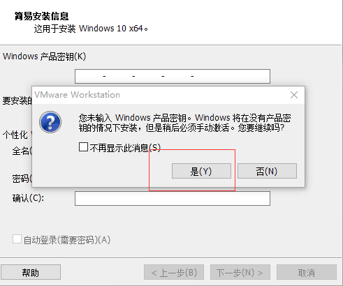

VMWARE
====
First: You need copy windows10.64zip
---

 

 

 

 

 

 

 

 

 

 

 

 

 

 

 

 

 

 

 

 

 

 

 

 

 

 

 

 

 

 

 

 

 

 

 

 

 

 

 

 

 

 

 

 

 

 

 

 

 

 

 

 

 

 

 

 

 

 

 

 

 

 

 

 

 

 

 

 

 

 

 

 

 

 
[87](VMWARE/87.jpg)
 

 

 

 

 

 

 

 

 

 

 

 

 

 

 

 

 

 

 

 

 

