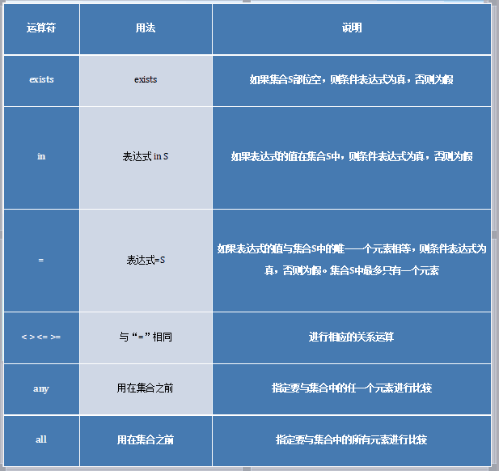

sql语句:
====
增:insert into 表名(列名,列名)value(数据,数据) 
--
删:update 表名 set 列名='新值' where 列名称='数据' 
--
改:delete from 表名 where 列名称='数据' 
--
查:select 列名,列名,... from 表名,表名 where 条件 
或select into 表名(数据,数据)
--
 
#常用数据类型:
>number:	数字 AS:SNO(156)
>> varchar/varchar2:字符串 AS:CNO('2-156')
> date:日期  AS: BIRTHDAY('2017-02-02')
>>to_char:日期转换 AS:TO_CHAR(2017,'YYYY')		
 

#建表语句格式:
	*create table =表名(列名varchar2,列名number,列名date)values(数据,数据,数据);
 
#增加列:
	*alter table 表名 add (column definitionl,column definitionl);
#更改现有列格式:
	*alter table 表名 modify (colmun_name1 newdefinition,column newdefinition2);
#删除列:
	*alter table 表名 drop (column_name1,column);
#删除表:
	*drop table 表名;
#去重:
	*select distinct 列名1,列名..from 表名,表名 where 条件

#关系运算:
>=,!=,<,>,<=,>=  :比较两个表达式的大小 
>like 用法like字符串 说明字符串的模糊匹配 
>in in(元素1,元素2) 
>between 用法 between :检查表达式是否在A与b之间 
>and,or 条件1 and 条件2,条件1 or 条件2:两个条件的连接 
>not 条件取反 
>is null 判断表达式是否为空 
#分组函数:
		Count返回找到的记录数
		Min返回一个数字列或是计算列的最小值
		Max返回一个数字列或是计算列的最大值
		Sum返回一个数字列或是计算列的总和
		Avg返回一个数字列或是计算列的平均值

#!:
>先where 条件(列名='') 再分组 (group by) 列名 在筛选 (having 列名='') 
>having子句通常和group by+组一起使用，用来限制搜索条件。having子句与组有关，不与单个值有关，它作用于group by的组: select 列名,列名,... from 表名 group by 组名 having 组限制条件 
#链接:
##内连接:
select 列 from 表1 inner(可省略) join 表2 on 连接条件; 
##外连接:
外连接分为左外连接、右外连接、全外连接。使用左外连接查询，返回的结果不仅仅是符合连接条件的行记录，还包含了左边表中的全部记录,全外连接返回所有匹配成功的记录，还包含了左、右表中未匹配成功的记录 
左外:select 列 from 表1 left join 表2 on 链接条件; 
全外:select 列 from 表1 full join 表2 on 连接条件; 
###union

###子查询
 
子查询一般出现在where子句中，包含子查询的语句通常采用图中所列格式中的一种 
 
 